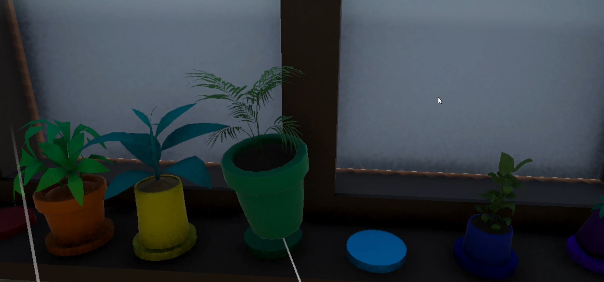
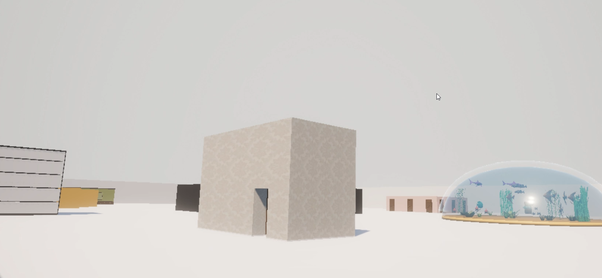
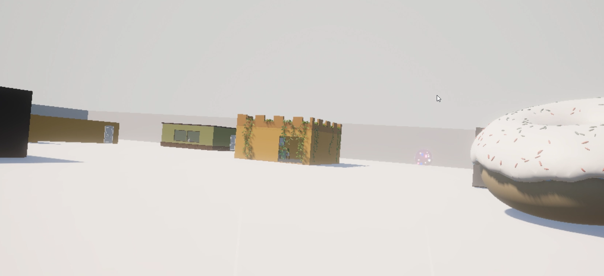
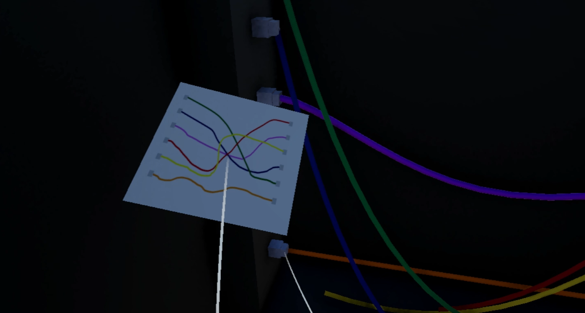
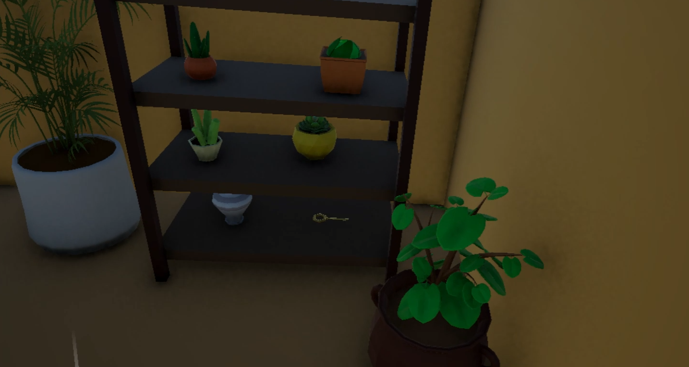
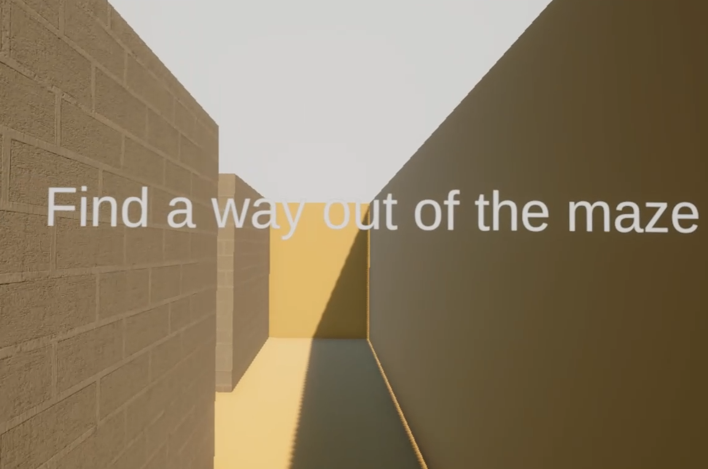
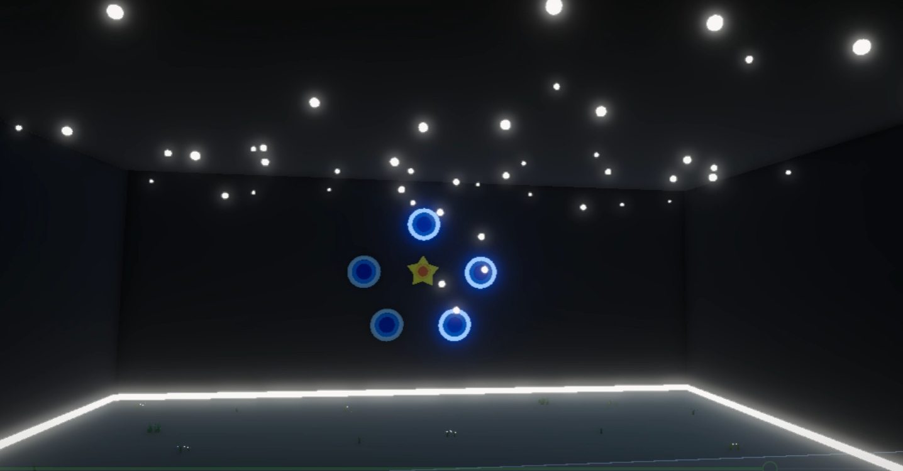

# The Room – VR Game

This is a virtual reality game created in Unity as a university assignment. The player is an adult who feels tired of the constant rhythm of life, trapped in a cycle of work, home, and sleep. When the character falls asleep, they enter a surreal dream world that looks like their childhood memories but is extremely bright, colorful, and a little strange.

This game was developed independently as my first Unity and VR project. I built the entire experience myself, from concept and story to gameplay mechanics and scene transitions.

## Game Concept

The story begins with the player having an internal conversation before bedtime. They are an adult who is exhausted by daily life and bored with routine. After falling asleep, they wake up in their childhood bedroom, where everything is vivid, funny, and unusually unreal.

The player does not want to stay in this dream room but cannot open the door. The only way forward is to solve a series of quests that gradually change the character's mood and understanding.

### Quest progression

1. **Rainbow flower pots**
   - The first quest is to place all flower pots in the correct rainbow order.
   - The room feels wrong because objects are misplaced, and this puzzle is the first clue to opening the door.
   - After completing the task, the door opens and the character receives a small emotional lift.

2. **Server room cable puzzle**
   - The player reaches a hub area and then enters a gray-white server room.
   - The room has a humming sound of servers, which draws attention to the next objective.
   - The second quest requires arranging cables in the correct order.
   - Different cable combinations cause different effects: lights off, red lights, alarm activation.
   - The correct combination plays a song, `Happy` by Pharrell Williams, and triggers a playful `dance break` sign.
   - This moment is meant to brighten the hero’s mood and add humor.

3. **Labyrinth challenge**
   - The third quest is to navigate a maze.
   - The maze can represent the character finding their way through inner confusion.

4. **Ball target room**
   - The final quest is to throw balls at targets in a room.
   - After the puzzle, the character has another internal dialogue about not comparing their life to others and accepting that feeling tired is normal.
   - The conclusion shows that the world is not wrong; the hero’s perspective is what needs to change.

## Technical Features

- **VR Interaction:** Objects respond to player motion and input in a VR environment.
- **Quest System:** Tracks objectives and shows progress after each task.
- **Object Physics:** Enables realistic grabbing, placing, and throwing.
- **Audio Triggers:** Plays sounds and voice cues tied to game events.
- **Save System:** Saves player position and object states to preserve progress.
- **Scene Controller:** Handles transitions between scenes and game flow.

## Project Structure

The main folders in this project include:
- `Assets/Scripts/Audio` — audio management and spatial sound.
- `Assets/Scripts/Objects` — object interaction, doors, and physics.
- `Assets/Scripts/Quests` — quest tracking and quest-specific behavior.
- `Assets/Scripts/Saving` — saving, loading, and persistent object state.
- `Assets/Scripts/ScenesController` — scene flow and menu control.
- `Assets/Scripts/UI` — in-game UI for quests and interaction prompts.
- `Assets/Scripts/Utils` — utility scripts for debugging and VR setup.

## Gallery

